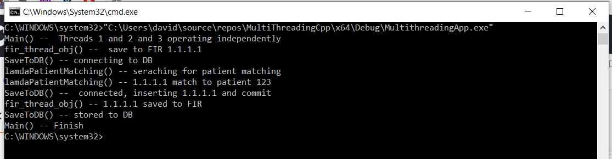

# MultiThreadingCpp

Sample cpp consule application demonstrating the use of thread performing Multithreading application option. 

Simply creating a new thread object and passing the executing code to be called (i.e, a callable object) into the constructor of the object.
### A callable can be either of the three

- A function pointer
- A function object
- A lambda expression

Based on geeksforgeeks [article](https://www.geeksforgeeks.org/multithreading-in-cpp/)

